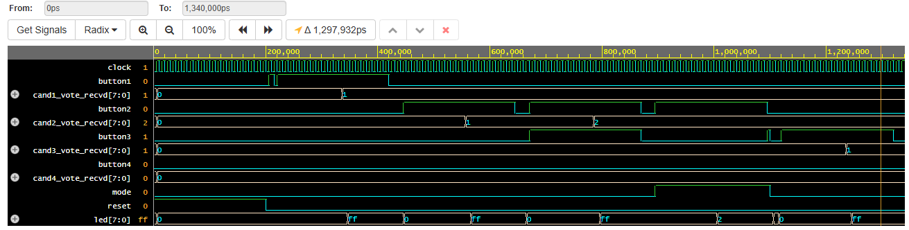

# EVM (Electronic Voting Machine)

This project implements a simple Electronic Voting Machine in SystemVerilog. The design features multiple modules for button debouncing, vote logging, mode control, and an integrated top-level voting machine. A testbench is included to simulate and verify the functionality.

---

## Features

- **Button Debouncing:** Ensures only valid button presses are registered as votes.
- **Multiple Candidates:** Supports four candidates, each with a dedicated button.
- **Voting & Result Modes:**  
  - *Voting Mode:* Users can cast votes.  
  - *Result Mode:* Displays the vote count for each candidate.
- **Visual Output:** 8-bit LED output indicates system state and results.
- **Testbench:** Automatic simulation of voting and result scenarios.
- **Waveform Output:** Generates a VCD waveform (`waveform.png`).

---

## File Overview

- `design.sv`: Main SystemVerilog design file with all modules.
- `testbench.sv`: Testbench to simulate and verify the design.
- `waveform.png`: Example waveform output from simulation.
- `README.md`: Project documentation.

---

## Modules Description

- **buttonControl:** Debounces the button press and outputs a valid vote signal.
- **modeControl:** Manages system mode (voting/results) and controls LED outputs.
- **voteLogger:** Records votes for each candidate.
- **votingMachine:** Top-level module connecting all components.

---

## How It Works

### Voting

- Press and hold a candidate's button to register a vote.
- The system debounces input to avoid false triggers.

### Viewing Results

- Switch to result mode by changing the mode input.
- Press a candidate’s button to display their vote count on the LEDs.

---

## Running the Simulation

Use a SystemVerilog simulator such as **Icarus Verilog**, **ModelSim**, or **Vivado**.

1. Compile `design.sv` and `testbench.sv`.
2. Run the simulation to produce a VCD file.
3. View the waveform (`waveform.png`) using a waveform viewer (e.g., GTKWave).




**Example (using Icarus Verilog):**
```bash
iverilog -g2012 -o evm_tb design.sv testbench.sv
vvp evm_tb
gtkwave dump.vcd
